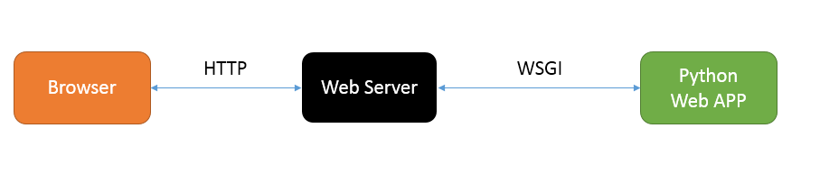

# WSGI 入门

## What is WSGI
Web服务器网关接口（`Python Web Server Gateway Interface`，缩写为`WSGI`）是为`Python`语言定义的`Web服务器`和`Web应用程序`或`框架`之间的一种简单而通用的接口。
自从WSGI被开发出来以后，许多其它语言中也出现了类似接口。

## Why WSGI

The goal is to provide a relatively simple yet comprehensive interface capable of supporting all (or most) interactions between a Web server and a Web framework. 
(Think "CGI" but programmatic rather than I/O based.)

An additional goal is to support "middleware" components for pre- and post-processing of requests: think gzip, recording, proxy, load-balancing.
No mechanism for deployment and relatively few mechanisms for configuration are specified in the PEP. (That's a problem Python Paste targets.)
