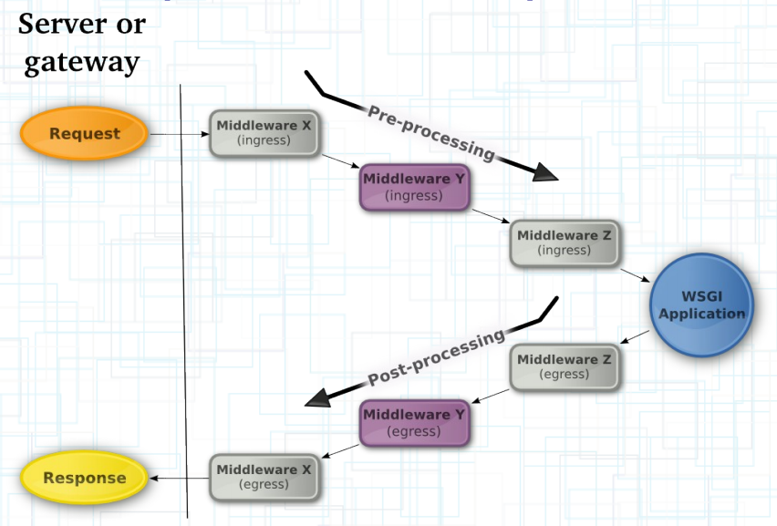

# WorkFlow

WSGI的基本处理模式为: WSGI Server -> (WSGI Middleware)*-> WSGI Application

流程如下：

WSGI Server可以理解为一个符合WSGI规范的webserver，接收request请求，封装一系列环境变量，按照WSGI规范调用注册的WSGI App，最后将response返回给客户端。

WSGI Server的基本处理流程（以wsgiref为例）：

1. 服务器创建socket，监听端口，等待客户端连接。当有请求来时，服务器解析客户端信息放到环境变量environ中，并调用绑定的handler来处理请求。

2. handler解析这个http请求，将请求信息例如method，path等放到environ中。

3.wsgi handler再将一些服务器端信息也放到environ中，最后服务器信息，客户端信息，本次请求信息全部都保存到了环境变量environ中。

4. wsgi handler 调用注册的wsgi app，并将environ和回调函数传给wsgi app

5. wsgi app 将reponse header/status/body 回传给wsgi handler

6. 最终handler还是通过socket将response信息塞回给客户端
